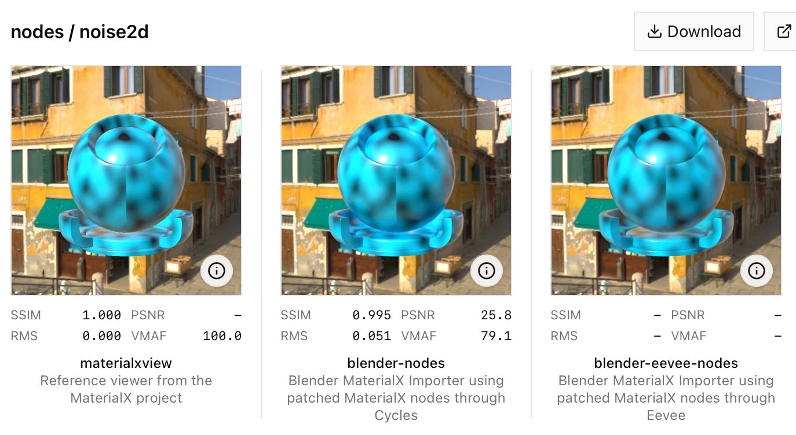
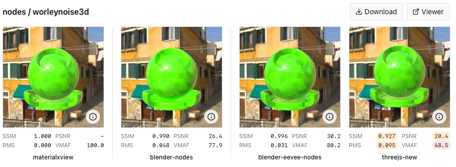

# Blender MaterialX Importer

Blender MaterialX Importer loads MaterialX documents into Blender materials.

It is designed as a practical MaterialX-to-Blender compiler: the goal is a faithful Blender material that renders like the source, not a 1:1 reconstruction of every XML element or nodegraph detail from the original `.mtlx` file.

The development and validation of this importer is described in the blog post [Pixel-Perfect MaterialX in Blender and Three.js](https://ben3d.ca/blog/pixel-perfect-materialx-in-blender-and-threejs).

This importer is validated with the [`MaterialX Fidelity Suite`](https://github.com/bhouston/material-fidelity), which renders MaterialX samples through Blender Cycles and Eevee and compares the results against reference MaterialX renders.



For best results, use a Blender build that includes the custom MaterialX shader nodes from [Blender PR #158054](https://projects.blender.org/blender/blender/pulls/158054). Stock Blender builds remain supported, but some procedural nodes fall back to approximate Blender-native equivalents.



## Quick Start

Run a script with Blender:

```bash
blender --background --python examples/import_material.py -- /path/to/material.mtlx /tmp/imported.blend
```

Or use the importer from your own Blender Python script:

```python
from materialx_importer import load_materialx_as_blender_material

result = load_materialx_as_blender_material("/path/to/material.mtlx")
material = result.material

for warning in result.warnings:
    print("MaterialX importer warning:", warning)
```

The return value is a `MaterialImportResult`:

- `material`: the created `bpy.types.Material`.
- `warnings`: non-fatal import warnings, including fallback and unsupported-feature notices.

## Philosophy

MaterialX and Blender do not have identical shader graphs, node contracts, renderer semantics, or standard-library implementations. This importer treats that mismatch directly:

- It maps MaterialX surface models and nodes to the Blender material graph that best preserves visual behavior.
- It uses Blender-native shader nodes when they are a good match.
- It emits warnings when it falls back to approximate behavior.
- It does not try to preserve the original MaterialX file as a round-trippable Blender node tree.

The best results come from Blender builds that include the custom MaterialX shader nodes from [Blender PR #158054](https://projects.blender.org/blender/blender/pulls/158054). In particular, procedural MaterialX noise, fractal, cell noise, Worley noise, and unified noise nodes can be reproduced much more accurately when Blender exposes matching `ShaderNodeMx*` nodes. Without those nodes, the importer remains useful, but some nodes are approximated with Blender's built-in procedural textures.

## Supported Features

Supported surface models:

- `standard_surface`
- `gltf_pbr`
- `open_pbr_surface`

Supported MaterialX node categories:

- Math: `absval`, `acos`, `add`, `asin`, `atan2`, `ceil`, `clamp`, `cos`, `divide`, `div`, `exp`, `floor`, `fract`, `invert`, `length`, `ln`, `magnitude`, `max`, `min`, `modulo`, `mul`, `multiply`, `power`, `range`, `remap`, `rotate2d`, `rotate3d`, `round`, `safepower`, `sign`, `sin`, `smoothstep`, `sqrt`, `subtract`, `tan`.
- Vector math: `crossproduct`, `distance`, `dotproduct`, `normalize`, `reflect`, `refract`.
- Structure and channels: `combine2`, `combine3`, `combine4`, `dot`, `extract`, `separate2`, `separate3`, `separate4`.
- Texture and placement: `bump`, `checkerboard`, `circle`, `gltf_colorimage`, `gltf_image`, `gltf_normalmap`, `heighttonormal`, `image`, `normalmap`, `place2d`, `tiledimage`.
- Geometry: `frame`, `normal`, `position`, `tangent`, `texcoord`, `time`.
- Procedural noise: `cellnoise2d`, `cellnoise3d`, `fractal2d`, `fractal3d`, `noise2d`, `noise3d`, `unifiednoise2d`, `unifiednoise3d`, `worley2d`, `worley3d`, `worleynoise2d`, `worleynoise3d`.
- Logic and conditionals: `and`, `ifequal`, `ifgreater`, `ifgreatereq`, `not`, `or`, `xor`.
- Color: `blackbody`, `colorcorrect`, `contrast`, `hsvtorgb`, `luminance`, `rgbtohsv`, `saturate`, `unpremult`.
- Matrix and space transforms: `creatematrix`, `determinant`, `invertmatrix`, `transformmatrix`, `transformnormal`, `transformpoint`, `transformvector`, `transpose`.
- Ramps: `ramp`, `ramp_gradient`, `ramp4`, `ramplr`, `ramptb`, `splitlr`, `splittb`.
- Compositing and mix: `burn`, `difference`, `dodge`, `minus`, `mix`, `overlay`.

Coverage is best understood through rendered validation rather than this static list alone. The MaterialX Fidelity Suite remains the source of truth for which features reproduce closely in Cycles and Eevee.

## Validation

Rendering fidelity is validated outside this repository by the [`MaterialX Fidelity Suite`](https://github.com/bhouston/material-fidelity).

That suite renders MaterialX samples through multiple renderers and compares output images against MaterialX references. This importer is exercised there through Blender renderers for:

- Cycles, using the importer and custom MaterialX nodes where available.
- Eevee, using the same importer and custom MaterialX nodes where available.
- Stock or less-specialized Blender configurations, where fallback behavior is expected for some nodes.

Keeping validation in `material-fidelity` keeps this repository focused on the importer while allowing reproducibility tests, renderer setup, sample assets, image metrics, and visual reports to evolve independently.

## Installing For Development

From this repository:

```bash
python -m pip install -e ".[dev]"
```

When running inside Blender, make sure this repository root is on `sys.path`, or install it into the Python environment used by your Blender build.

For one-off scripts, adding the checkout path is enough:

```python
import sys
sys.path.insert(0, "/path/to/blender-materialx-importer")
```

## Public API

The intentionally small API is:

```python
from materialx_importer import MaterialImportResult, load_materialx_as_blender_material
```

`load_materialx_as_blender_material(mtlx_path: str) -> MaterialImportResult` reads a MaterialX document, compiles a supported surface shader to a new Blender material, and returns any warnings collected during import.

Future options should stay narrow and renderer-independent, for example:

- Overriding the generated material name.
- Compiling into an existing Blender material.
- Strict mode for treating fallbacks as errors.
- Structured warning callbacks.

Renderer setup, camera framing, shader-ball assets, image generation, and metrics are intentionally not part of this package.

## Custom MaterialX Nodes

Some MaterialX nodes have no exact equivalent in stock Blender. The importer detects matching Blender node types from [Blender PR #158054](https://projects.blender.org/blender/blender/pulls/158054) at runtime and uses them when available.

Examples include:

- `ShaderNodeMxNoise2D`
- `ShaderNodeMxNoise3D`
- `ShaderNodeMxFractal2D`
- `ShaderNodeMxFractal3D`
- `ShaderNodeMxCellNoise2D`
- `ShaderNodeMxCellNoise3D`
- `ShaderNodeMxWorleyNoise2D`
- `ShaderNodeMxWorleyNoise3D`
- `ShaderNodeMxUnifiedNoise2D`
- `ShaderNodeMxUnifiedNoise3D`

If those nodes are unavailable, the importer falls back to Blender-native procedural nodes where possible and records warnings in `MaterialImportResult.warnings`.

## Contributing

Good contributions usually include:

- A focused importer change.
- A small MaterialX sample that demonstrates the behavior.
- A note about whether the behavior is exact, approximate, or dependent on custom Blender nodes.
- A fidelity check in `material-fidelity` when the change affects rendered output.

When adding node support, prefer preserving visual behavior over preserving source graph shape. If a feature cannot be represented exactly in Blender, emit a clear warning instead of silently pretending it is exact.

## License

MIT. See [`LICENSE`](LICENSE).
